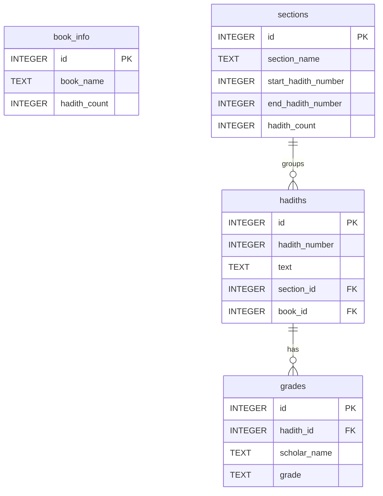

# Compressed Hadith SQLite API

[](#)
[](#)
[](#)

A high-performance, offline-ready, statically-hosted Hadith API that delivers compressed SQLite databases to mobile, desktop, and web applications. It allows developers to integrate comprehensive Hadith search and browsing capabilities into their apps with extremely low latency and zero server-side maintenance costs.

---

## 🚀 Key Features

- **Static API Hosting:** Zero server maintenance. Host the entire API and all database assets on GitHub Pages, Cloudflare Pages, Netlify, or Vercel.
- **Compressed sqlite.zip:** Databases are distributed as compressed `.sqlite.zip` archives, reducing bandwidth consumption by up to 70%.
- **Pre-configured SQLite FTS5:** Full-Text Search (FTS5) is enabled and synchronized via database triggers for instant, offline search.
- **Language & Book Metadata:** Standardized metadata indexes mapping books, hadith counts, chapter definitions, grades, and SHA-256 checksums.
- **Multilingual Support:** Multi-language databases out of the box, including Arabic (`ara`), English (`eng`), Bengali (`ben`), French (`fra`), Urdu (`urd`), Turkish (`tur`), Indonesian (`ind`), Tamil (`tam`), Russian (`rus`), and more.

---

## 📦 Directory Structure

```text
compressed_hadith_sqlite/
├── index.html                 # Beautiful documentation and interactive URL generator
├── script.js                  # Frontend logic for documentation
├── style.css                  # Modern, premium dark-themed styling
├── all_info.json              # Global index of all languages & books metadata
├── [lang]/
│   ├── info.json              # Language-specific book index & checksums
│   └── [edition].sqlite.zip   # Compressed SQLite databases (e.g., eng-bukhari.sqlite.zip)
```

---

## 📡 API Reference & Endpoints

Since this API is fully static, you can configure your base hosting URL (e.g., `https://yourdomain.com` or `https://username.github.io/repo-name`) and access the following JSON endpoints:

### 1. Get All Books & Languages Metadata
Retrieve a global list of all supported languages, their books, hadith counts, file sizes, and checksums.

*   **URL:** `{baseUrl}/all_info.json`
*   **Method:** `GET`
*   **Response Format (JSON):**
    ```json
    {
      "eng": [
        {
          "book": "eng-bukhari",
          "name": "Sahih al Bukhari",
          "hadith_count": 7278,
          "section_count": 97,
          "checksum": "ab24dfb5556ee906cd01c4ff218eff2533af933b2e34dade4ccb76d0b871b400",
          "zip_path": "eng/eng-bukhari.sqlite.zip",
          "file_size": 6524928,
          "zip_size": 2807405
        }
      ],
      "ben": [ ... ]
    }
    ```

### 2. Get Language Metadata
Retrieve specific details and books available for a particular language code (e.g., `eng`, `ben`, `ara`). Useful for lazy-loading metadata for specific languages.

*   **URL:** `{baseUrl}/{lang}/info.json`
*   **Method:** `GET`
*   **Example:** `{baseUrl}/eng/info.json`
*   **Response Format (JSON):**
    ```json
    {
      "language": "eng",
      "books": [
        {
          "book": "eng-bukhari",
          "name": "Sahih al Bukhari",
          "hadith_count": 7278,
          "section_count": 97,
          "checksum": "ab24dfb5556ee906cd01c4ff218eff2533af933b2e34dade4ccb76d0b871b400",
          "zip_path": "eng/eng-bukhari.sqlite.zip",
          "file_size": 6524928,
          "zip_size": 2807405
        }
      ]
    }
    ```

### 3. Download Compressed SQLite ZIP
Direct download link for a book's compressed SQLite database.

*   **URL:** `{baseUrl}/{lang}/{edition}.sqlite.zip`
*   **Example:** `{baseUrl}/eng/eng-bukhari.sqlite.zip`
*   **Method:** `GET`

---

## 🗄️ SQLite Database Schema

Each extracted `.sqlite` file adheres to a standardized, highly-optimized schema. This schema ensures unified querying across different editions and languages.



### Table Schemas

#### 1. `book_info`
Contains global metadata for the specific database file.
```sql
CREATE TABLE book_info (
    id INTEGER PRIMARY KEY AUTOINCREMENT,
    book_name TEXT,
    hadith_count INTEGER
);
```

#### 2. `sections`
Represents the chapters or sections of the Hadith book.
```sql
CREATE TABLE sections (
    id INTEGER PRIMARY KEY AUTOINCREMENT,
    section_name TEXT,
    start_hadith_number INTEGER,
    end_hadith_number INTEGER,
    hadith_count INTEGER
);
```

#### 3. `hadiths`
Stores the actual text of each Hadith and its references.
```sql
CREATE TABLE hadiths (
    id INTEGER PRIMARY KEY AUTOINCREMENT,
    hadith_number INTEGER,
    text TEXT,
    section_id INTEGER,
    book_id INTEGER,
    FOREIGN KEY (section_id) REFERENCES sections (id)
);
```

#### 4. `grades`
Provides academic authenticity gradings (e.g., Sahih, Hasan, Da'if) for each Hadith where available.
```sql
CREATE TABLE grades (
    id INTEGER PRIMARY KEY AUTOINCREMENT,
    hadith_id INTEGER,
    scholar_name TEXT,
    grade TEXT,
    FOREIGN KEY (hadith_id) REFERENCES hadiths (id)
);
```

#### 5. `hadiths_fts` (Virtual Table)
SQLite FTS5 full-text search table, automatically synchronized with `hadiths` using SQLite triggers.
```sql
CREATE VIRTUAL TABLE hadiths_fts USING fts5(
    text,
    content='hadiths'
);
```

---

## 🛠️ Integration Guide

Follow these steps to integrate the Hadith SQLite databases into your mobile (Flutter, React Native, Swift, Kotlin) or desktop application:

### Step 1: Discover Supported Databases
Fetch `all_info.json` to get the list of supported languages and available editions.

### Step 2: Check for Updates (Optional but Recommended)
Store the active database's `checksum` locally on the device. Periodically (or on app startup), fetch the remote `{lang}/info.json` or `all_info.json` and compare the local checksum with the remote one. If they differ, trigger a download to update the database.

### Step 3: Download & Decompress
Download the `.sqlite.zip` archive directly to the client's file system, and unzip it locally to extract the `.sqlite` file:
```javascript
// Example in Node.js / React Native / Flutter concept
const downloadUrl = "https://your-hosting.com/eng/eng-bukhari.sqlite.zip";
const localZipPath = `${FileSystem.documentDirectory}/eng-bukhari.sqlite.zip`;
const localDbPath = `${FileSystem.documentDirectory}/eng-bukhari.sqlite`;

await downloadFile(downloadUrl, localZipPath);
await unzip(localZipPath, FileSystem.documentDirectory);
await removeFile(localZipPath); // Clean up zip
```

### Step 4: Open & Query SQLite
Open the unzipped `.sqlite` file using your framework's SQLite library. You can perform complex searches and lookups entirely offline.

#### Get Hadith with its Section & Grades
```sql
SELECT 
    h.hadith_number, 
    h.text AS hadith_text, 
    s.section_name,
    g.scholar_name,
    g.grade
FROM hadiths h
LEFT JOIN sections s ON h.section_id = s.id
LEFT JOIN grades g ON h.id = g.hadith_id
WHERE h.hadith_number = 1;
```

#### High-Performance Full-Text Search (FTS5)
Search millions of words in milliseconds:
```sql
SELECT 
    h.hadith_number, 
    h.text, 
    s.section_name
FROM hadiths_fts f
JOIN hadiths h ON f.rowid = h.id
JOIN sections s ON h.section_id = s.id
WHERE hadiths_fts MATCH 'intention'
LIMIT 20;
```

---

## 🌐 Quick Web Hosting Setup

To host this repository as an API and provide documentation for other developers:

1.  **Clone or Fork** this repository.
2.  **Upload** it to your chosen host:
    *   **GitHub Pages:** Push the repo, then go to `Settings -> Pages` and select the main branch.
    *   **Cloudflare Pages:** Connect your GitHub repo, select `HTML` framework, and deploy.
    *   **Vercel / Netlify:** Import the project as a static site and deploy.
3.  Ensure your hosting platform has **CORS** enabled (GitHub Pages and Cloudflare Pages enable CORS for static files by default) so that external mobile/web apps can fetch the JSON and ZIP files directly.

---

## 📄 License

This documentation and layout are licensed under the MIT License. The underlying Hadith datasets belong to their respective researchers and compilers.

*Built with ❤️ for the Ummah.*
